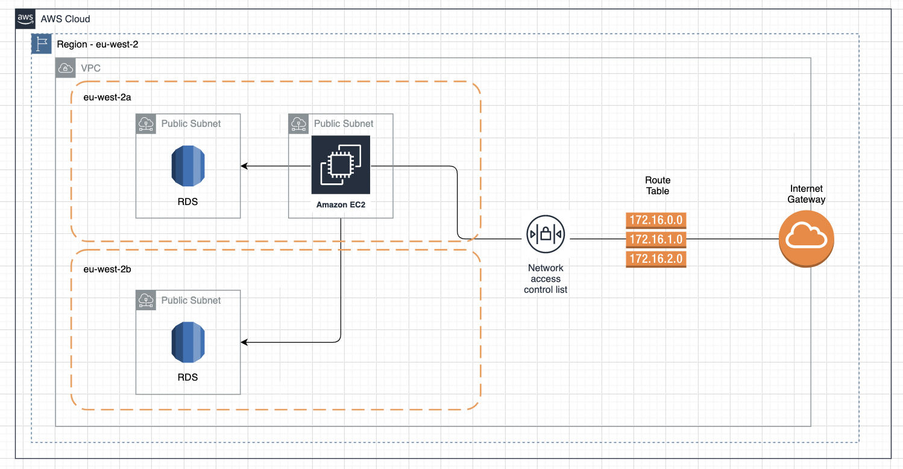

# Platform Team Recruitment - Challenge 1

The **challenge-1** directory contains the IaC for a network on AWS based on an infrastructure diagram and a brief. The network itself is far from suitable for its given purpose and there are flaws in both the network and security of this infrastructure. 
It will be your job to identify these flaws and make changes accordingly. These can be programmatic changes to the terraform within this directory or documented justification on the suggested change and why you would make it.

## Infrastructure Diagram

## Brief
A buisiness has asked you to take a look at their cloud infrastructure. The company has ≈100 employees spread out across europe and uses a web app (hosted on the infrastructure described in the infrastructure diagram) to log hours. They are aware, however, that the network they have designed is not secure or fit for purpose. Your task is to ammend the network in any way you deem to be neccessary.
This task exists to test your knowledge of cloud infrastructures, AWS services, Infrastructure as Code and security; Any changes you make must either be programmatic (changing the terraform) or documented (description of change, reason for making it).
The company would also like to know what changes you would make to the infrastructure as a whole; What additional services on AWS would help improve the network in a scaleable and secure way.

### Infrastructure Requirements 
* System must be HIGHLY AVAILABLE; Work force is spread around europe, everyone needs access at acceptable speeds.
* System must be SECURE; Pay close attention to the IaC and the properties of the infrastructure
* System must be deployable through IaC. Any changes you make to the terraform, make sure the code is correct and deployable

### Useful Information
* Any changes you make ensure they are documented even if you haven't added it programatically
* This challenge is not a make-or-break but allows Naimuri to assess your current knowledge of skills key to a member of the platform team!
* Pay close attention to the visibility of things in the network.  What should be visible to the outside world?
* An infrastructure diagram (using a tool like draw.io) would also be good to show the changes you'd make to the network.